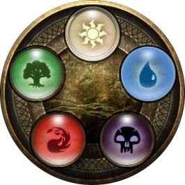
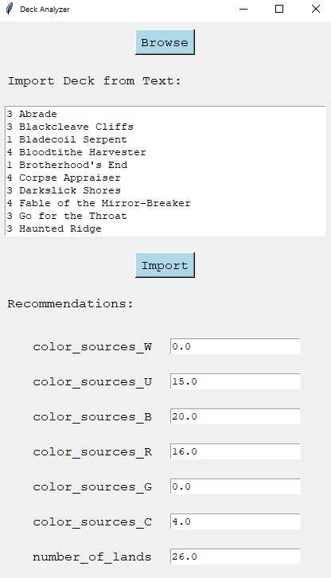

# Magic: the Gathering Land Recommender

This recommender is based on a machine learning model that predicts the number of lands and color sources required for a given Magic the Gathering decklist. Built using a multi-output random forest algorithm and trained on data scraped from mtgtop8.com, this tool provides a data-driven approach to deck building that can help players optimize their decks for maximum performance.

The model takes any Magic the Gathering decklist as input and generates predictions for the number of lands and color sources required for each of the game's five color sources - red, blue, black, green, and white.

 

These predictions are based on a range of factors, including:
 - Total mana cost of the deck
 - Number of colored casting cost "pips" in each of the five colors
 - Amount of draw or cycling effects
 - Treasure token creation
 - Number of nonland color sources
 - Amount of hybrid mana or phyrexian mana in casting costs
 - Number of X costed spells (XX and XXX are counted more heavily)
 - Cards with cost-reduction or that can play themselves or other cards for free (cascade, affinity, etc.)

With its accurate predictions and user-friendly interface, the "Magic the Gathering Land Recommender" is a valuable tool for players looking to optimize their decks and gain a competitive edge. Whether you're a seasoned pro or a newcomer to the game, this project provides a powerful example of how machine learning can be used to improve performance in complex gaming environments.

Simply click on `Browse` and navigate to the decklist, or paste it into the text field and click on `Import` and see the results below.

For a detailed breakdown of how I scraped the data, cleaned it, and then trained the model I will write a series in medium going through each step and decision I made along the way.

https://medium.com/@peter-papuli
